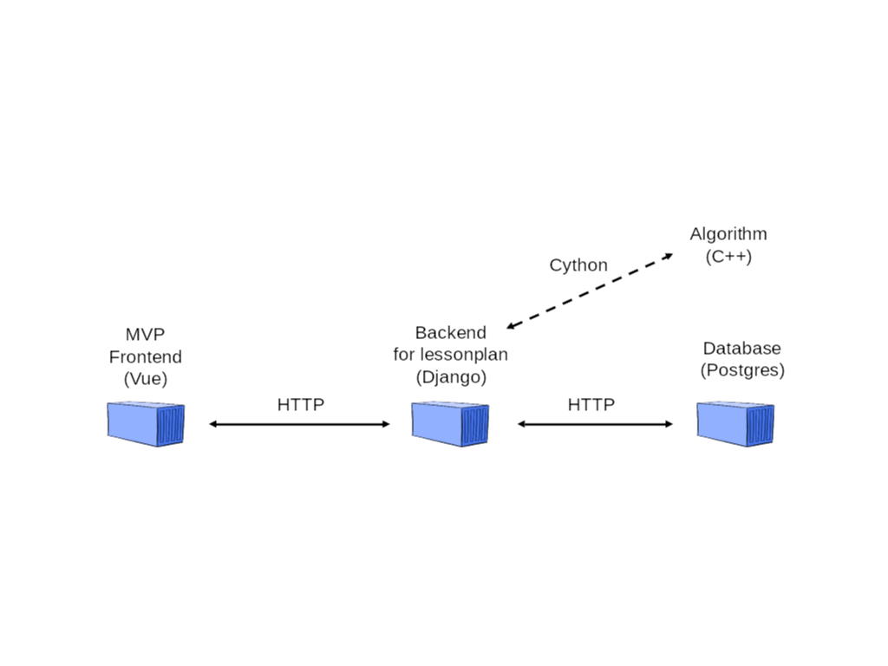
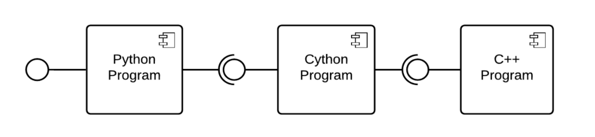
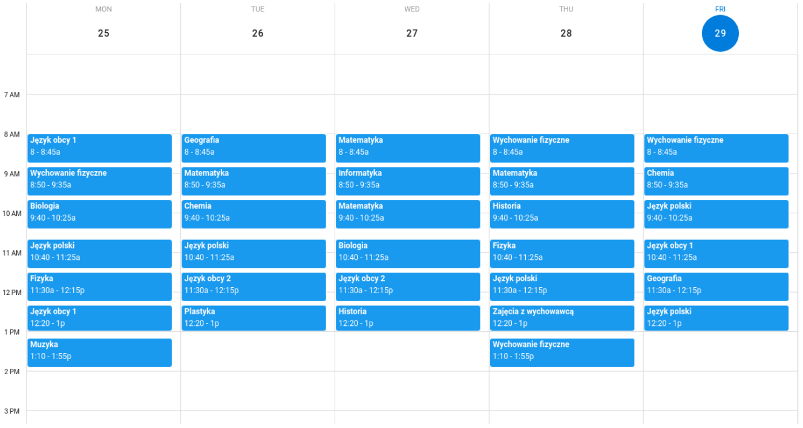
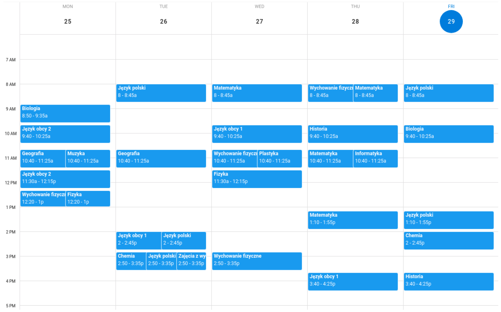

# Lesson plan scheduler

Free, open source lesson plan scheduler for public education. Nowadays for primary schools in Poland. In the future for every public education sector on the whole world. To use by every public educational institution on [learntray.com](http://learntray.com), completely for free.

## Architecture

The whole system is created and managed by Docker, separated into three main containers:

Algorithm in C++ is included in backend container as a Python extension thanks to Cython.

The architecture of a program treated as a Python extension module consists of three main levels:

In such a case Python program is responsible for validating data and its simple preparation. However Cython program is mainly responsible for much more rigorous data preparation for C++ interfaces. The last one is C++ Program which is responsible to find lesson plan for a given set of data.

The C++ program with proposed optimization method is created in all cases with three main parts/objects:

- Problem specification
- Algorithm
- Solution

These objects are used straight within Cython context.

## Scheduling results

This section includes example solutions of finding lessonplan for primary school.

Example class timetable in one of the best solutions of greedy algorithm as well as genetic algorithm:

For comparison, example class timetable in one of the best solutions of random search algorithm

## Setup instruction

- It is better to have more than few GB of memory available to run all services properly.
- Install [Docker with Docker Compose](https://docs.docker.com/get-docker/).
- From main project directory run `docker-compose up` - Docker will pull and build all images, than it should build algorithm and start backend after a while on http://0.0.0.0:8000/ as well as frontend on http://localhost:8080/ - make sure it is started before use.

## Usage

- 1st option - custom data - go to http://localhost:8080/#/example-school/management/lessons, insert some data, generate lesson plans and check them out on http://localhost:8080/#/example-school/lessonplans.
- 2nd option - predefined data - make requst to http://localhost:8000/lessonplans/saveData/?data-complexity=low, then go to go to http://localhost:8080/#/example-school/management/lessons, generate lesson plans and check them out on http://localhost:8080/#/example-school/lessonplans

## Future plans

It is an example of scheduler for creating lesson plans for primary schools in Poland. Schedulers for other sectors and countries will also be developed in other repos.

The idea is to create the set of tools, like schedulers, completely for free for public education, and open sourced. It will be available on [learntray.com](http://learntray.com) as soon as possible.
